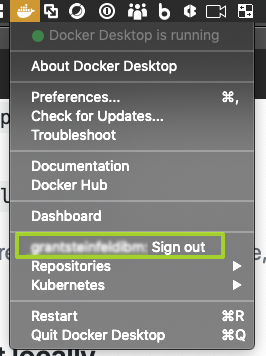
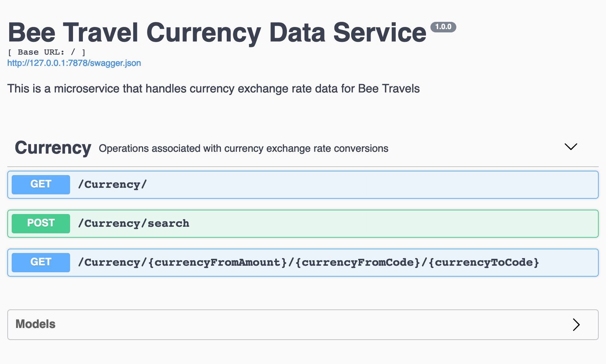
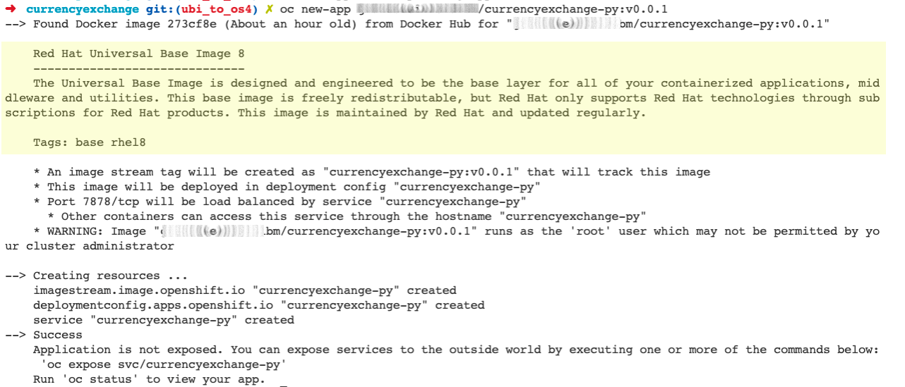
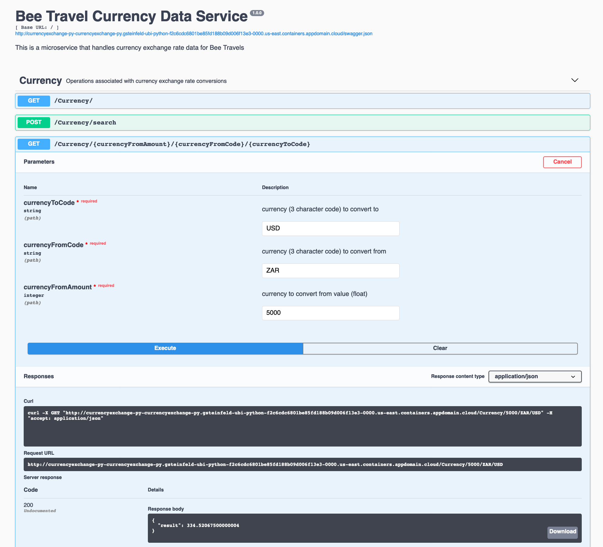
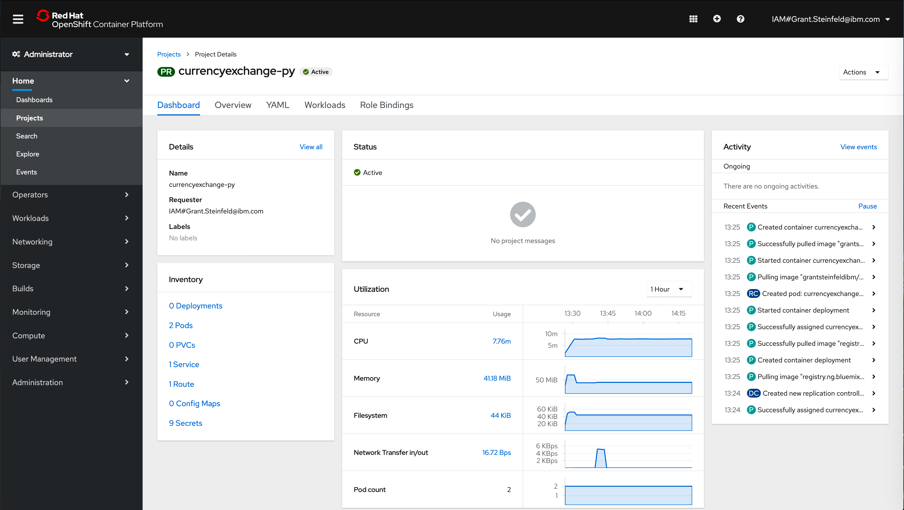
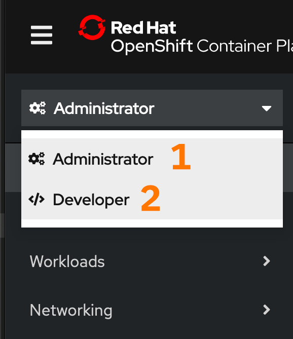
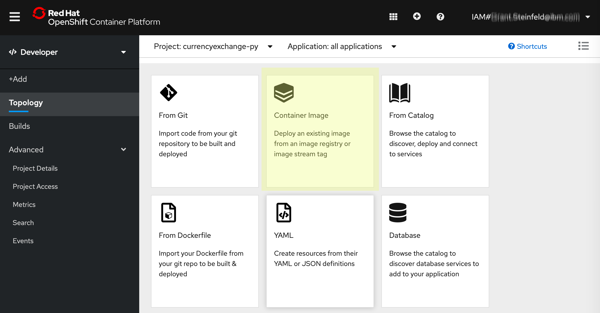
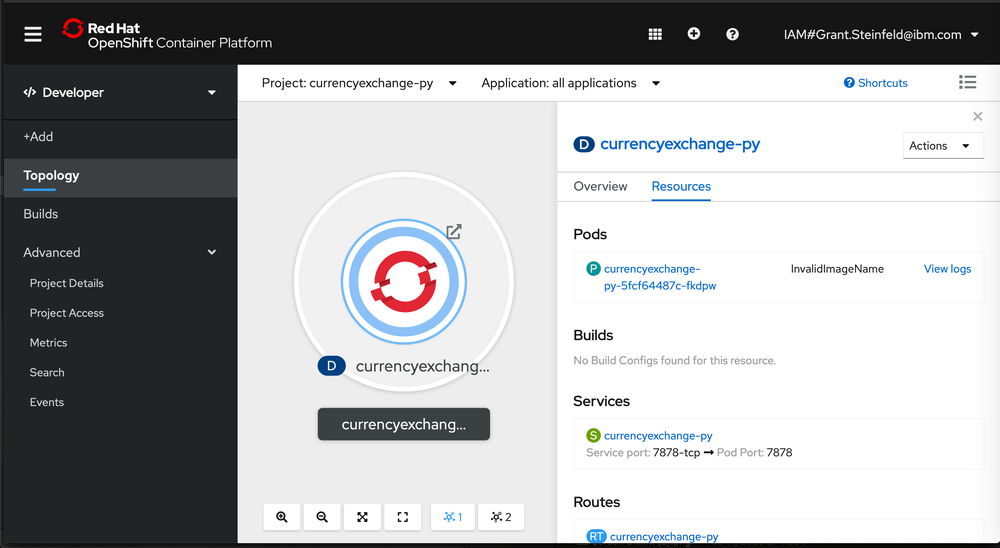
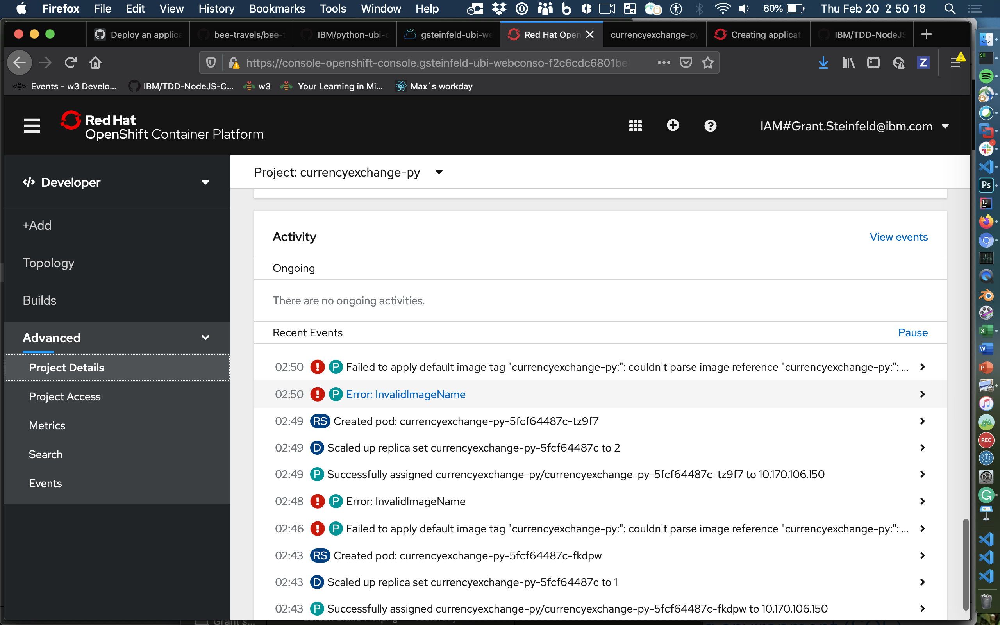
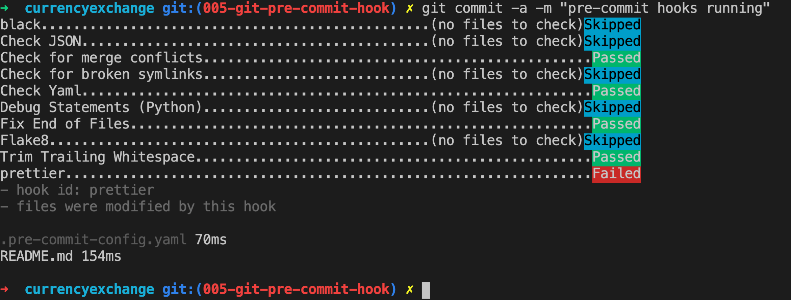

# Bee Travels - Currency Exchange Microservice

This is a python3 Currency Exchange Microservice, that was developed by using a Test Driven Development (TDD) approach.

## SUPERMARINE BUILD
set env var

BASE_URL_ENDPOINT="http://localhost:7777/"

BASE_URL_ENDPOINT="https://api.exchangeratesapi.io/"


## Included components

1. Pipenv
1. pytest
1. black
1. flake8
1. pre-commit

## Steps to run this code

1. ensure you have the pre-requisites as defined below
1. clone this repository `git clone https://github.com/bee-travels/bee-travels-python.git`
1. change to the repo root dir `cd bee-travels-python/`
1. checkout development branch `git checkout development`
1. change to the root dir for currencyexchange `cd src/currencyexchange/`
1. ensure `pipenv` will be local to your dir structure `export PIPENV_VENV_IN_PROJECT=1`
1. setup `pipenv` run: `pipenv install --three`
1. check `pipenv` run: `pipenv check`
1. activate `pipenv` run: `pipenv shell`
1. install runtime python packages with `pipenv` run: `pipenv install`
1. install dev python packages with `pipenv` run: `pipenv install --dev`
1. install `pre-commit` git hook run: `pipenv run setup_dev`
1. run the unit-tests run: `pytest`
1. start the flask microservice run: `python src/main.py`
1. browse to the swagger test harness by navigating to [http://127.0.0.1:7878](http://127.0.0.1:7878)

## Introducing the RedHat Universal Base Image (UBI)

At the core of containers there is a lighter weight Linux operating system. Most of us have used Ubuntu or Alpine as the base Operating system.

Now there is a Enterprise Linux alternative from RedHat called the Universal Base Image (UBI).

UBI is three things:

1. A set of three base images (`ubi`, `ubi-minimal`, `ubi-init`)
1. A set of language runtime images (`node.js`, `python`, etc.)
1. A set of associated packages in a `YUM repository` which satisfy common application dependencies

### Use the RedHat UBI to build a docker image, then run it locally

Regard our [Dockerfile](./Dockerfile) and notice the new `FROM` directive is for the UBI version 8 ( core of RedHat 8)

```yaml
FROM registry.access.redhat.com/ubi8/ubi
```

Now let's build this docker image with the `RedHat UBI`.

1. Make sure you are at the root of this application.
1. Note your docker-hub username

<details><summary><strong>How to find your docker hub credentials</strong></summary>

> To download Docker desktop you must create a Docker hub account.

> To find the username, you can click on at your Docker desktop icon (mac) toolbar



</details>

1. Build the docker image by running:

```bash
export DOCKERHUB_USERNAME=<your-dockerhub-username>
docker build -t $DOCKERHUB_USERNAME/currencyexchange-py:v0.0.1 .
```

<details><summary><strong>Expected output details</strong></summary>

Here is a truncated snippet of the successful output you should see:

```bash
Sending build context to Docker daemon  69.63MB
Step 1/10 : FROM registry.access.redhat.com/ubi8/ubi
 ---> fd73e6738a95

 ...

Collecting flask (from -r requirements.txt (line 13))
  Downloading https://files.pythonhosted.org/packages/9b/93/628509b8d5dc749656a9641f4caf13540e2cdec85276964ff8f43bbb1d3b/Flask-1.1.1-py2.py3-none-any.whl (94kB)

 ...

Successfully built 3b5631170697
Successfully tagged <DOCKERHUB_USERNAME>/currencyexchange-py:v0.0.1
```

</details>

Great! So, now lets run the image locally!

```bash
docker run -p 7878:7878 $DOCKERHUB_USERNAME/currencyexchange-py:v0.0.1
```

At your command line run: `docker ps` and you should now confirm that the docker container for the currencyexchange microservice is up and running.


> Explore the microservice from your browser at
> [http://127.0.0.1:7878](http://127.0.0.1:7878) for documentation about this API's endpoints and a `try-it-out` test harness to actually run the API calls.




### Deploy to IBM Cloud

1. To allow changes to the this microservice, create a repo on [Docker Cloud](https://cloud.docker.com/) where you can push the newly modified container. 

> NOTE: If a new repo is used for the Docker containers, the container `image` will need to be modified to the name of the new repo used in [./deploy/currencyexchange-deploy.yaml](./deploy/currencyexchange-py-deploy.yaml).

```bash
# build docker image
export DOCKERHUB_USERNAME=<your-dockerhub-username>

docker build -t $DOCKERHUB_USERNAME/currencyexchange-py:v0.0.1 .

docker login

# push image to docker hub
docker push $DOCKERHUB_USERNAME/currencyexchange-py:v0.0.1

```
<details><summary><strong>What a successful push to docker hub should look like</strong></summary>

```bash
The push refers to repository [docker.io/grantsteinfeldibm/currencyexchange-py]
693f7ba0eeed: Pushed 
225cfc6f0260: Pushed 
2ddc888e45c8: Pushed 
1aac3cbf59e3: Pushed 
85f69e555a1b: Pushed 
1295eae54c9d: Pushed 
v0.0.1: digest: sha256:2aa41155a8bd44bb2558cb990ed4d5f455968ef88697463456f249a35654841d size: 1574
```
</details>


2. Provision an [IBM RedHat OpenShift 4 Service](https://cloud.ibm.com/kubernetes/catalog/openshiftcluster)
and follow the set of instructions for creating a Container and Cluster.

### There are 2 ways to deploy the image to OpenShift.

1. Using the Developer Tools CLI
2. OpenShift web console


#### Step 1) Using the [Developer Tools CLI](https://www.ibm.com/cloud/cli):

Login to the IBM Cloud 
> NOTE use `--sso` if you have a single sign on account, or delete for username/password login

```bash
ibmcloud login --sso
```
Login to your cluster


click the Actions/Connect via CLI ( annotated with a number(1) above ) and follow the instructions:

use `oc login ... ` to login to your cluster, for example 
```sh
oc login --token=X8bjO-ROAhGUx8S9pvge6pMdLQzrFysuG9SSgSI6hyg --server=https://c100-e.us-east.containers.cloud.ibm.com:31102
```

create a new project

```bash
oc new-project currencyexchange-py
```

you should be able to confirm this by typing:

```bash
oc project
```
and see


next add a new application

```bash
oc new-app $DOCKERHUB_USERNAME/currencyexchange-py:v0.0.1
```

Great!  Now you should see



Note the yellow highlight section confirms that the RedHat UBI is the base image in your docker deployment.

Almost there!  You will need to expose the microservice to the outside world by executing

```bash
oc expose svc/currencyexchange-py

#expected output
# route.route.openshift.io/currencyexchange-py exposed

#get the external URL to access the microservice
oc status

```


So copy and paste the url indicated in yellow highlight above into your favorite web browser and voila!  You should see:




Looking at the OpenShift Web console we can now see our microservice all setup and running nicely.




#### Step 2) Using the OpenShift web console

After provisioning your OpenShift cluster, click on the blue `OpenShift web console` button indicated by the number two(2) in the image below.


You should now see the web console.

Note that there are 2 ***perspectives*** of the web console, the `administrator` and the `developer`.  Switch to the developer view by clicking on the Administrator (default) option and selecting the Developer option indicate by the number two (2) in the image below 



The ***Developer*** perspective in the web console provides you the following options from the Add view to create applications and associated services and deploy them on OpenShift Container Platform:

There are various options to choose from here, we will choose the `Container Image` where you will use the existing image you previously built and pushed to DockerHub and deploy it on your OpenShift Container Platform.



<details><summary><strong>Learn more about application creation options as an OpenShift Developer</strong></summary>


1. From Git: Use this option to import an existing codebase in a Git repository to create, build, and deploy an application on OpenShift Container Platform.

1. Container Image: Use existing images from an image stream or registry to deploy it on to OpenShift Container Platform.

1. From Catalog: Explore the Developer Catalog to select the required applications, services, or source to image builders and add it to your project.

1. From Dockerfile: Import a dockerfile from your Git repository to build and deploy an application.

1. YAML: Use the editor to add YAML or JSON definitions to create and modify resources.

To learn more check out the [OpenShift developer documentation](https://docs.openshift.com/container-platform/4.3/applications/application_life_cycle_management/odc-creating-applications-using-developer-perspective.html#odc-creating-applications-using-developer-perspective)
</details>

Fill out the image name text box on your DockerHub repository.  It should be:

`$DOCKERHUB_USERNAME/currencyexchange-py:v0.0.1`

where `$DOCKERHUB_USERNAME` is you Docker hub username.

Click on the `search icon`  (magnifying glass) to the left of the text box.

It should fetch the image metadata from DockerHub and create a nice form.


Click on the blue create button indicated with the number one(1) above.

Great!  You should now see a nice topology and summary of the application you just created:



You should now be able to click on the public IP that was by default created for you. See and click on the route, e.g.

`http://currencyexchange-py-currencyexchange-py.gsteinfeld-ubi-webconso-f2c6cdc6801be85fd188b09d006f13e3-0000.us-east.containers.appdomain.cloud/`

You should now see Python flask swagger input screen:


Congratulations!  You have now successfully created an application from a container image.


### Trouble shooting ( maybe beta issues? )
If your application is not running look at the `Events` tab:



Here we see an `Invalid Image Name` - corrective action would be ***tbd***


# Development Notes

These notes describe the process that was used to build this Python microservice

## Install the pre-requisites

1. Python version 3.7.x or later
1. Pipenv - Python virtual environment

## Installation steps

### 1. Python version 3.7.x

Make sure you have Python3 installed and it's availible from your command line. You can check if it's installed and determine it's version by running:

```sh
python --version
```

You shoud get some output like `3.7.5` If you don't have this version of Python, please install the latest `3.7.x` version.

To install python 3 on a Mac

```sh
brew install python3
```

<details><summary><strong>Installation of Python3 on other platforms</strong></summary>
To [install Python3 on RHEL](https://developers.redhat.com/blog/2018/08/13/install-python3-rhel/)

To [install Python3 on Ubuntu](https://www.digitalocean.com/community/tutorials/how-to-install-python-3-and-set-up-a-programming-environment-on-an-ubuntu-18-04-server)

To [install Python3 on Windows](https://phoenixnap.com/kb/how-to-install-python-3-windows)

To install Python on any other platform take a look at the [Installing Python](https://docs.python-guide.org/starting/installation/) section of **_The Hitchhikers Guide to Python_** or refer to [python.org](http://python.org)

</details>

### 2. Pipenv - Python virtual environment

To check you have pipenv installed run the following:

```sh
pipenv --version
```

You should see something like `version 2018.11.26` if not please setup the latest version of pipenv as follows.

To install pipenv on a Mac using brew

```sh
brew install pipenv
```

<details><summary><strong>Installation of Pipenv on other platforms</strong></summary>

> If you have a working installation of pip, and maintain certain “toolchain” type Python modules as global utilities in your user environment, pip user installs allow for installation into your home directory. Note that due to interaction between dependencies, you should limit tools installed in this way to basic building blocks for a Python workflow like virtualenv, pipenv, tox, and similar software.

To install pipenv on anyplatform with `pip`

```sh
pip install --user pipenv

#or
# todo: validate this
python3 -m pip install pipenv

```

For more detailed instruction [see here](https://pipenv-fork.readthedocs.io/en/latest/install.html#installing-pipenv)

</details>

It is a best practice to use use Python virtual environments to isolate project-specific dependencies and create reproducible environments.

<details><summary><strong>Read more about Pipenv and Virtual Environments</strong></summary>

### Pipenv Features

- Pipenv is a production-ready tool that aims to bring the best of all packaging worlds to the Python world. It harnesses Pipfile, pip, and virtualenv into one single command.

- Enables truly **_deterministic builds_**, while specifying only what is needed.

- With pipenv you no longer need to use `pip` and `venv` separately.

* Setting a virtual environment to separate each project from affecting other projects and the rest of your operating system's a good idea. You may be making changes in your virtual environment that could have unintended consequences.

Learn more about Pipenv [here](https://pipenv-fork.readthedocs.io/en/latest/)

</details>

### Intializing a `pipenv` Python Virtual Environment

How does one setup a Python Virtual Environment using `pipenv`?

#### What is a virutal env

It's a copy of a physically installed version of python already have, so say you have python3 install via brew or some other method, you can find this by typing

```sh
which python3
echo '/usr/local/bin/python3'
```

#### You may be asking yourself where your new virtual environment is stored?

Ordinarilly, by default, the `pipenv` virutal enviroments is written to a global (your user's home ) dirctory. The issue here is if you move your project directory this will corrupt the virutal environment.

So never fear!

```sh

export PIPENV_VENV_IN_PROJECT=1
# save this line to your ~/.bashrc or ~/.zshrc or equivalent
```

### Creating a new Pipenv Python3 Virtual Environment

At your command line `cd` to the `root directory` of the currency exchange.

```sh
cd src/currencyexchange
pipenv install --three
```

You should now confirm the new local to your project, `Pipenv` Python Virtual Environment by output similar to this:


So great! Now pipenv created a virtual environment and created a `Pipfile` and a `Pipfile.lock`

Check!

```sh
pipenv check
```

Output should confirm all is good!


You can also confirm the virtual environment is setup by confirming a new file called `Pipfile` exists at the root directory.

Even though the `pipenv` virtual environment is setup, you still need to **_activate_** it. This is simply done by running:

```sh
pipenv shell
```


To exit the `Pipenv` Python Virtual environment simply type `exit`

### Setting up tooling for Testing

#### Setting up the pytest unit-test framework

> pytest is a no-boilerplate alternative to Python’s standard unittest module

```sh
pipenv install --dev pytest
```

`pytest` is used to write tests first and begin our journey towards Test Driven Development, been a fully-featured and extensible test tool, it boasts a simple syntax. Creating a test suite is as easy as writing a module with a couple of functions:

```python
#contents of tests/unit/test_sample.py
def plusOne(x):
    return x + 1

def test_simple():
    assert plusOne(7) == 8
```

the test is run by running the pytest command.

```sh
pytest tests/unit/test_sample.py
```


### Code stylers and formatters

`Flake8` is a command-line utility for enforcing style consistency across Python projects.

<details><summary><strong>learn more about flake8</strong></summary>

> [Flake8](https://flake8.pycqa.org/en/latest/index.html), by default it includes lint checks provided by the PyFlakes project, PEP-0008 inspired style checks provided by the PyCodeStyle project, and McCabe complexity checking provided by the McCabe project. It will also run third-party extensions if they are found and installed.

</details>

`Black` is a Python formatting tool.

<details><summary><strong>learn more about Black</strong></summary>
> By using Black, you agree to cede control over minutiae of hand-formatting. In return, Black gives you speed, determinism, and freedom from pycodestyle nagging about formatting. You will save time and mental energy for more important matters.

> Black makes code review faster by producing the smallest diffs possible. Blackened code looks the same regardless of the project you’re reading. Formatting becomes transparent after a while and you can focus on the content instead.

[Read the Black documentation](https://black.readthedocs.io/en/stable/) for more information

</details>

To install these:

```sh
pipenv install --dev flake8 black==19.10b0
```

### Version Control Integration - black + flake8 with git pre-commit hooks

Git hook scripts are useful for identifying simple issues before submission to code review.

<details><summary><strong>Learn more about pre-commit</strong></summary>

> "... We run our hooks on every commit to automatically point out issues in code such as missing semicolons, trailing whitespace, and debug statements. By pointing these issues out before code review, this allows a code reviewer to focus on the architecture of a change while not wasting time with trivial style nitpicks."

[quote from](https://pre-commit.com/)

</details>

Add new python packages:

```sh
pipenv install --dev pre-commit
pipenv install --dev flake8-bugbear
```

#### add [scripts] block to pipfile for pre-commit hook

```bash
[scripts]
# Install the pre-commit hook
setup_dev = "sh -c \"pre-commit install\""
```

Add a `.pre-commit-config.yaml` file.
[Here is the contents](./.pre-commit-config.yaml)

#### Setup the pre-commit hooks

```sh
pipenv run setup_dev
```

Ready? Time to check git pre-commit hook works as expected!

run:

```sh
git commit README.md -m "test commit"
```

> TIP! If this is the first time you run this, it will take 5-9 minutes depending on your local laptop or workstation's cpu/RAM horsepower.

You should see something like this output in your terminal window.


Yay!!!

After you've run pre-commit the first time, subsequent commit's will be `fast` ( seconds ).

The output is less verbose and like I said, it will be much much faster!



## Logging

Logs provide visibility into the behavior of a running app. Logs are the stream of aggregated, time-ordered events collected from the output streams of all running processes and backing services.

<details><summary><strong>Learn more about logging</strong></summary>

> A [twelve-factor app[(https://12factor.net/logs)] never concerns itself with routing or storage of its output stream. It should not attempt to write to or manage logfiles. Instead, each running process writes its event stream, unbuffered, to `stdout`. During local development, the developer will view this stream in the foreground of their terminal to observe the app’s behavior.

> In staging or production deploys, each process’ stream will be captured by the execution environment, collated together with all other streams from the app, and routed to one or more final destinations for viewing and long-term archival. These archival destinations are not visible to or configurable by the app, and instead are completely managed by the execution environment.

### Motivation to instrument logging in your code

> Diagnostic logging records events related to the application’s operation. If a user calls in to report an error, for example, the logs can be searched for context.

> Audit logging records events for business analysis. A user’s transactions can be extracted and combined with other user details for reports or to optimize a business goal.

[The Hitchhiker's Guide to Python: Logging](https://docs.python-guide.org/writing/logging/)

</details>

## Start Test Driven Development

### Red-Green-Refactoring.

There are 5 basic steps as illustrated in Figure 1. below.


**_Figure 1. The 5 stages in the Red-Green-Refactor software development cycle_**

Requests originate from the BDD / Agile Design phase/thinking sessions.

Common requests are new feature stories or issue/bug fixes.

These are the 5 steps:

1. Pick a request from your project management system [1]

   1. Action it! by Read, understand the request

1. Write a test to reflect the requirement
   1. run test it must fail!! `(Red)`
1. Write the code
   1. run test - code until test passes `(Green)`
1. refine, cleanup code `(Refactor)`
   1. run test - if fails continue to refactor till it passes
1. rinse, lather, repeat.

### Sometimes tests expect exctpions so how to make them not fail.

How to properly assert that an exception gets raised in pytest?

According to this [Stackoverflow post](https://stackoverflow.com/questions/23337471/how-to-properly-assert-that-an-exception-gets-raised-in-pytest) Pytest has 2 ways to accomadate this:

1. Using `pytest.raises` is likely to be better for cases where you are testing exceptions your own code is deliberately raising

1. using `@pytest.mark.xfail` with a check function is probably better for something like documenting unfixed bugs (where the test describes what "should" happen) or bugs in dependencies.

## Starting to code, the TDD way of course!

### The steps taken:

> 1.) Read and Grok the `Request: new feature`, read a csv data file and lookup by country name, in order to return
> the associated currency name and the standard 3 letter currency code

> 2.) Add a corresponding test first! (RED - 404 it should fail! )

> 3.) Wire up logic to function returning expected data (GREEN - test passes despite dummy data!)

> 4.) Refactor to actually read and filter the data from the csv ( RED-GREEN - iterate until code looks good!)

Great, feature one added and all tests pass!
Confident to continue? You bet ya!

> 1.) `Request: new feature`, access external external api to calculate the changing of money to another currency with 3 parameters:
> currencyAmount e.g. 10, currencyFrom e.g. United States Dollars (USD) toCurrency e.g. South African Rands (ZAR). Use the built in
> Python3 http client library, i.e. `urllib`

... similar steps mirror above 2-4

Great we can now access the external API ( Caveat Emptor, tests do not use pytest fixtures/mock data yet, need to get `monkeypatch` in conftest.py
figured out!!

> 1.) `Request: new feature`, make this python app a microserive itself, i.e. add a swagger-like REST API by using
> the awesome Python `Flask` and `Flask-RestPLUS` libraries.

TIP: to get `flask-restplus` to [work, downgrade](https://github.com/noirbizarre/flask-restplus/issues/777) Werkzeug by pinning version to 0.16.0

Fabulous! You should by now be able to access the REST API by navigating to:
[http://127.0.0.1:7878](http://127.0.0.1:7878)

## Foot notes

[1] Project management tool include:

- Jira
- Pivotal Tracker
- ZenHug
- GitHub issues
- other

# Resources

[Introducing the Red Hat Universal Base Image ](https://www.redhat.com/en/blog/introducing-red-hat-universal-base-image) - blog by Scott McCarty

[Python Testing with pytest: Simple, Rapid, Effective, and Scalable.](https://pragprog.com/book/bopytest/python-testing-with-pytest) Okken, Brian. Pragmatic Bookshelf.

[docs on flask-restplus](https://pypi.org/project/flask-restplus/)

# License

This code is licensed under the Apache License, Version 2. Separate third-party code objects invoked within this code pattern are licensed by their respective providers pursuant to their own separate licenses. Contributions are subject to the [Developer Certificate of Origin, Version 1.1](https://developercertificate.org/) and the [Apache License, Version 2](https://www.apache.org/licenses/LICENSE-2.0.txt).

[Apache License FAQ](https://www.apache.org/foundation/license-faq.html#WhatDoesItMEAN)
